# Лекция по Blender: Создание 3D подушки с текстом "JustSchool"

В этой лекции мы создадим 3D модель подушки с выдавленным текстом "JustSchool", используя физику ткани (Cloth Simulation) и процедурные материалы.

---

## Пошаговая инструкция

### 1. Удаляем всё
Начинаем с чистой сцены. Выделяем всё (`A`) и нажимаем `X` -> Delete.
Нажимаем на `Num 7` для перехода на вид сверху.

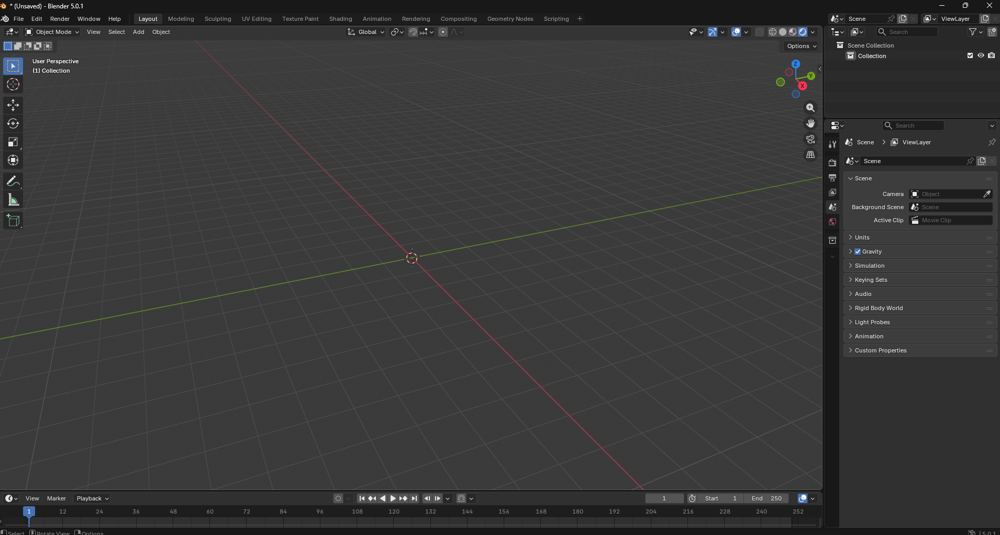

---

### 2. Создаём текст
Создаём текст через `Shift + A` -> Text.
Пишем **JustSchool**.

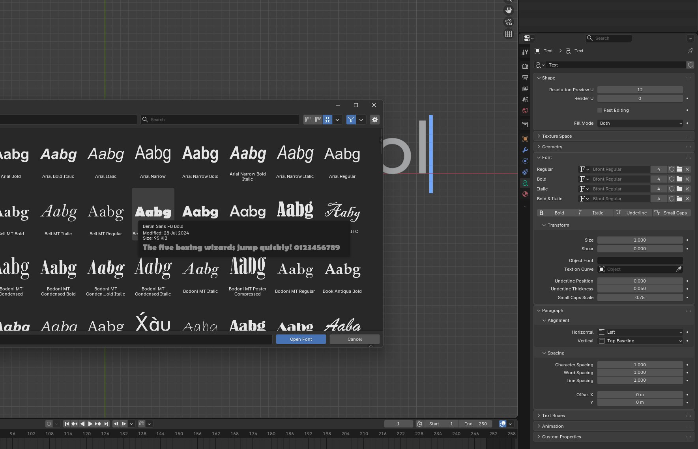

---

### 3. Выбираем фон (шрифт)
В правой панели переходим в `Data` -> `Font` -> `Regular`.
Выбираем любой жирный шрифт (например, Impact, Arial Bold или Bebas Neue).

> 📸 *Скриншот `img/3.png` отсутствует в директории*

---

### 4. Конвертируем в меш
Переходим в **Object Mode** (если были в Edit Mode).
Выделяем текст -> нажимаем `F3` -> в поиске пишем `Convert to Mesh` и выбираем.

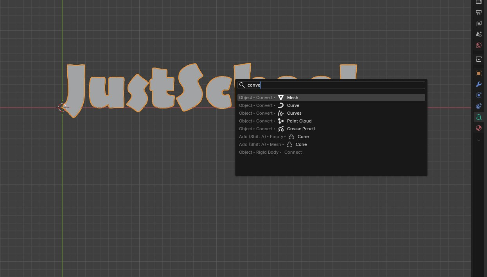

---

### 5. Переходим в Edit Mode и размещаем по середине
Нажимаем `Tab` для входа в **Edit Mode**.
Выделяем всё (`A`).
Перемещаем текст в центр сцены (`G` и пододвигаем мышью, либо `G` -> `Shift + X` / `Shift + Y` для точного выравнивания).

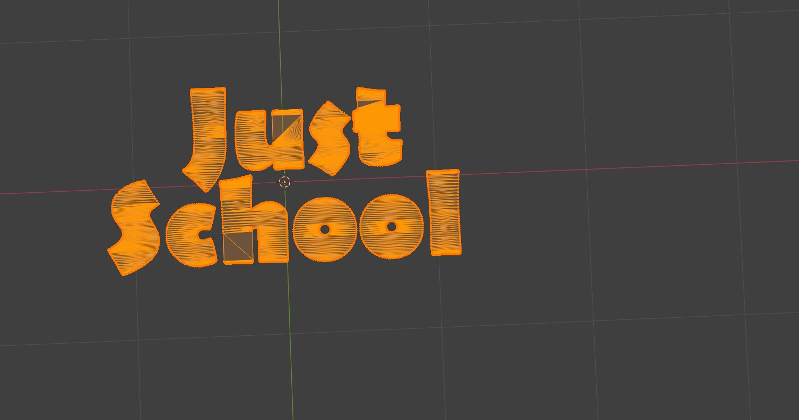

---

### 6. Экструдируем по Z
Всё ещё в Edit Mode, выделяем всё (`A`).
Нажимаем `E` -> `Z` и выдавливаем вершины вверх на небольшую высоту (примерно 0.2-0.3).

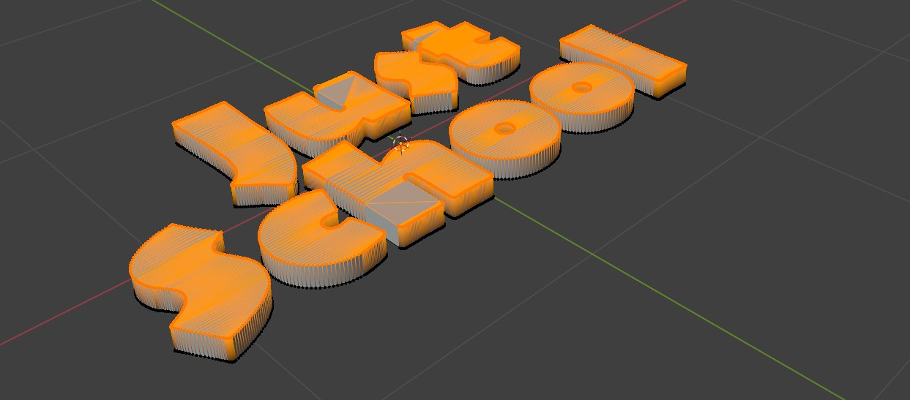

---

### 7. Добавляем модификатор Remesh
Выходим в **Object Mode** (`Tab`).
В правой панели идём во вкладку **Modifiers** (синий гаечный ключ).
Нажимаем `Add Modifier` -> в поиске пишем `Remesh`.
Ставим настройки:
- **Mode**: Sharp
- **Octree Depth**: 6
- **Smooth Shading**: убираем галочку (выключаем)

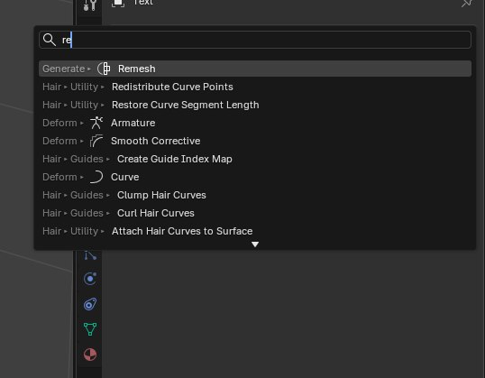

---

### 8. Выделяем острые грани
Переходим в **Edit Mode** (`Tab`).
Нажимаем `F3` -> в поиске пишем `Select Sharp Edges` и выбираем.

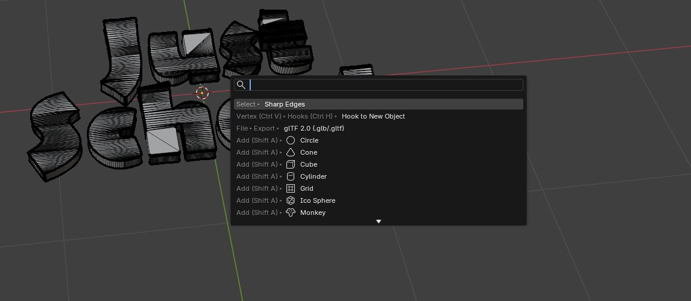

---

### 9. Smooth и растягиваем
Нажимаем ПКМ по выделенному -> **Shade Smooth**.
Чуть растягиваем текст по оси Y: нажимаем `S` -> `Y` и немного двигаем мышью.

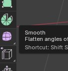

---

### 10. Добавляем Subdivision Surface
Выходим в **Object Mode**.
Идём в **Modifiers** -> `Add Modifier` -> `Subdivision Surface`.
Ставим **Levels Viewport = 2**.

> *(скриншот не требуется)*

---

### 11. Поворачиваем и создаём Plane
Выходим в Object Mode.
Поворачиваем текст или создаём Plane: `Shift + A` -> Mesh -> `Plane`.
Поворачиваем Plane: `R` -> `X` -> `-90` (ставим его горизонтально).

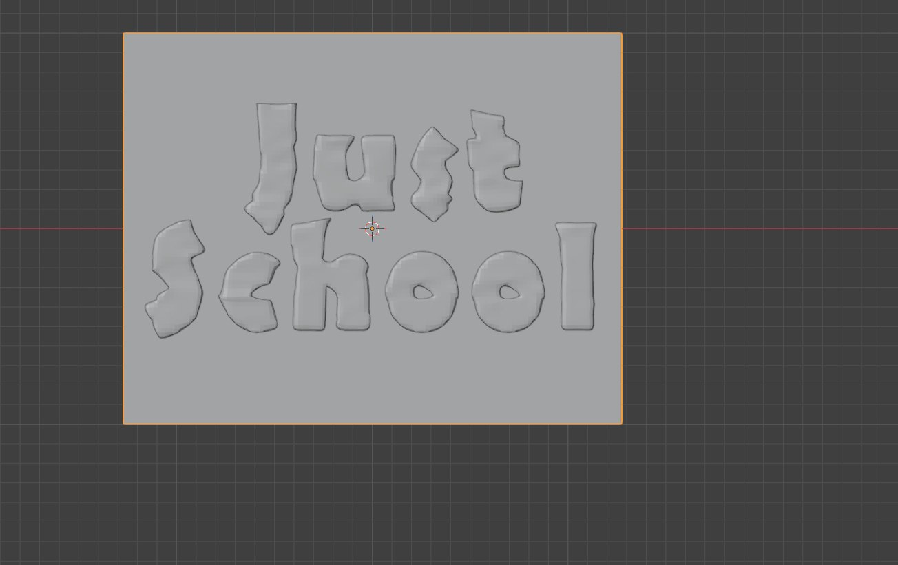

---

### 12. Чуть отдалим
Отодвигаем вид камеры (`Ctrl + средняя кнопка мыши` или зажимаем `Shift` и двигаем), чтобы видеть всю сцену.

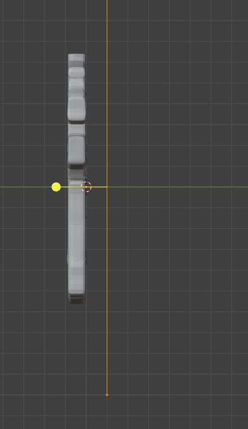

---

### 13. Делим на 50  
Переходим в **Edit Mode** на Plane (`Tab`).  
Нажимаем **ПКМ (правая кнопка мыши)** → выбираем **Subdivide**.  
В левом нижнем углу (или через `F9`) устанавливаем значение **Number of Cuts = 50**.

---

### 14. Экструдируем бортики
В Edit Mode выделяем самые крайние грани (удерживая `Alt` и кликая по краю).
Нажимаем `E` -> `Z` и выдавливаем вниз (отрицательная Z).

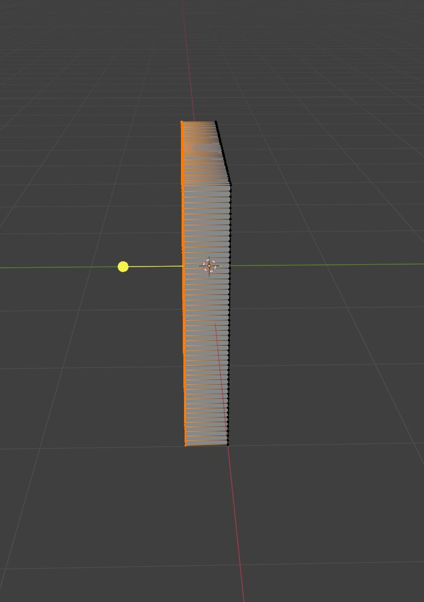

---

### 15. Смотрим, всё ли у нас в порядке с нормалями
Включаем отображение нормалей: вверху справа **Overlays** -> ставим галочку **Display Normals**.
Нормали (синие линии) должны смотреть **ВВЕРХ**.
Если нет — выделяем всё (`A`) и нажимаем `Shift + N` (Recalculate Outside).

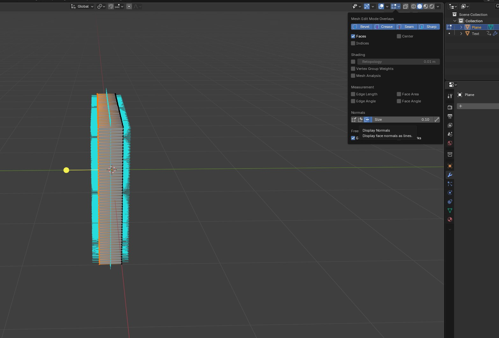

---

### 16. Выделяем все грани в центре и удаляем только верх
В Edit Mode выделяем **все** грани, которые находятся внутри (не бортики).
Удобно использовать режим выделения граней (`2` на клавиатуре) и удерживать `Shift`.
Нажимаем `X` -> **Faces** (удаляем только вершины/грани, оставляем рамку).

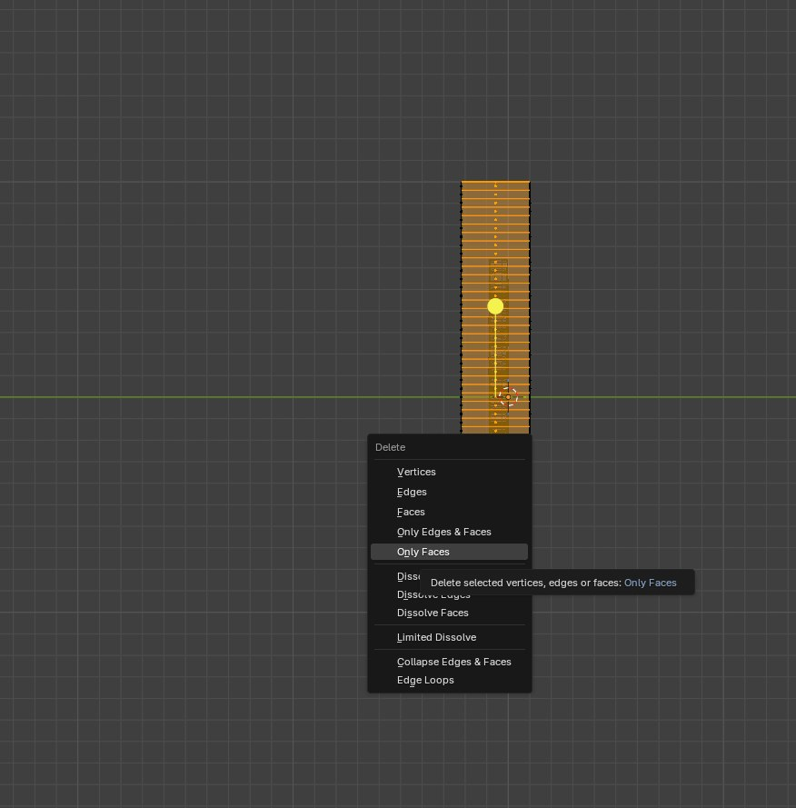
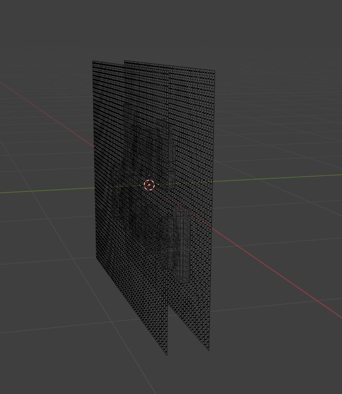

---

### 17. Выделяем все боковые грани и создаём группу
В Edit Mode выделяем все **боковые** (вертикальные) грани рамки.
В правой панели идём во вкладку **Object Data** (зелёный треугольник) -> **Vertex Groups**.
Нажимаем `+` (создать новую группу), называем её, например `Pin`.
Нажимаем **Assign** (назначаем выделенные вершины в группу).

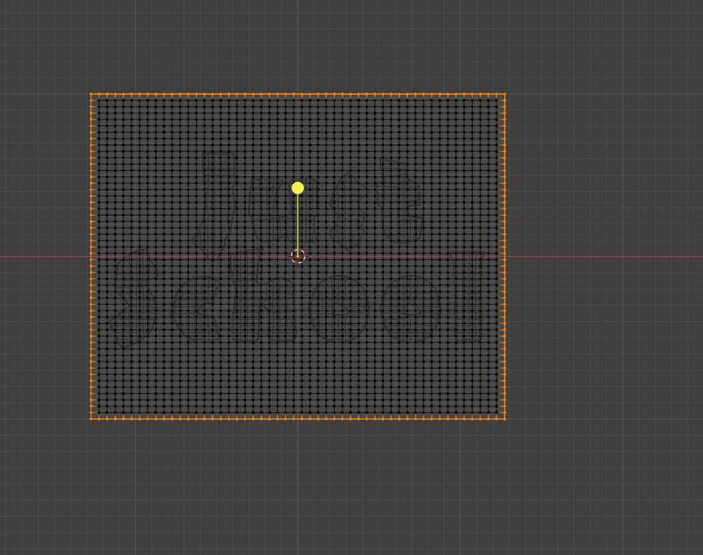
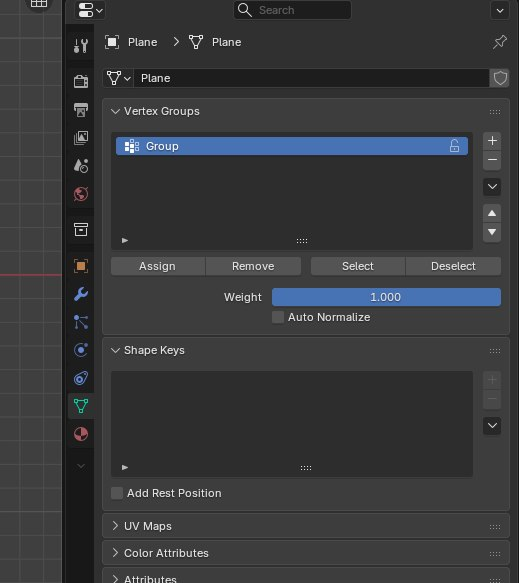

---

### 18. Переходим в Object Mode и добавляем физику ткани
Выходим в **Object Mode**.
Выделяем нашу рамку.
Идём в **Modifiers** -> `Add Modifier` -> `Cloth` (физика ткани).

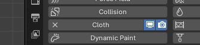

---

### 19. Включаем Pressure (давление)
В модификаторе Cloth находим раздел **Pressure** и ставим галочку.
Значение ставим **13** (подушка начинает надуваться).

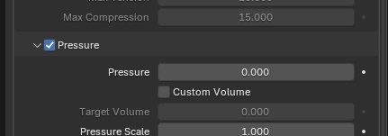

---

### 20. Спускаемся до Field Weights и вырубаем гравитацию
Прокручиваем модификатор Cloth вниз до раздела **Field Weights**.
Убираем галочку с **Gravity** (ставим 0, чтобы подушка не падала).

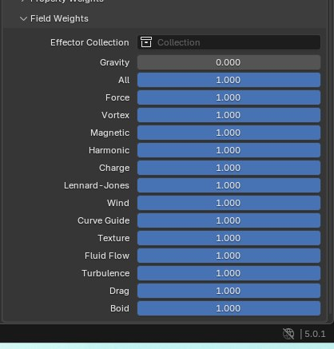

---

### 21. В Shape ставим Sewing
В модификаторе Cloth находим раздел **Shape**.
Включаем или настраиваем **Sewing Springs** (можно поставить значение ~10-20).

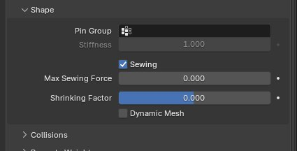

---

### 22. Результат симуляции
Запускаем анимацию (пробел) и смотрим, как подушка надувается.
Останавливаемся на моменте, где форма красивая.

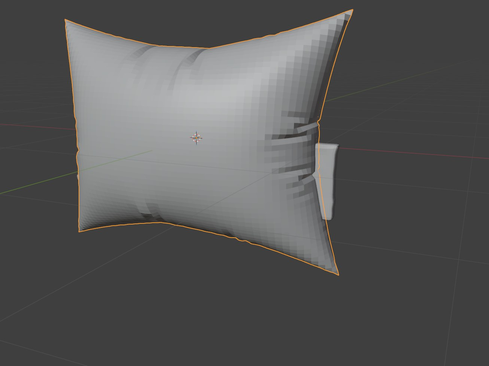

---

### 23. Применяем модификатор
Когда подушка раскрылась в красивой форме, останавливаем анимацию.
В модификаторе Cloth нажимаем на стрелочку вниз -> **Apply**.

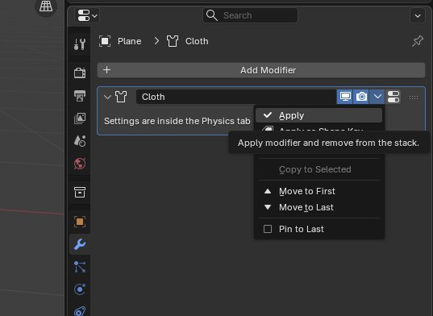

---

### 24. Опять добавляем модификатор Cloth
Добавляем **новый** модификатор Cloth (снова `Add Modifier` -> `Cloth`).
Теперь в разделе **Shape** в поле **Vertex Group** выбираем нашу группу `Pin`.
Ставим **Pressure = -15** (отрицательное давление — сдувание).
Включаем **Self Collisions** (ставим галочку).

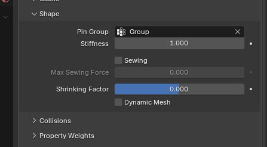

---

### 25. Увеличиваем текст и задаём коллизию
Переходим в **Edit Mode** на объекте **Текст**.
Увеличиваем его в размерах (`S`), чтобы он касался подушки.
Выходим в Object Mode и для текста добавляем физику: **Physics** -> `Collision`.

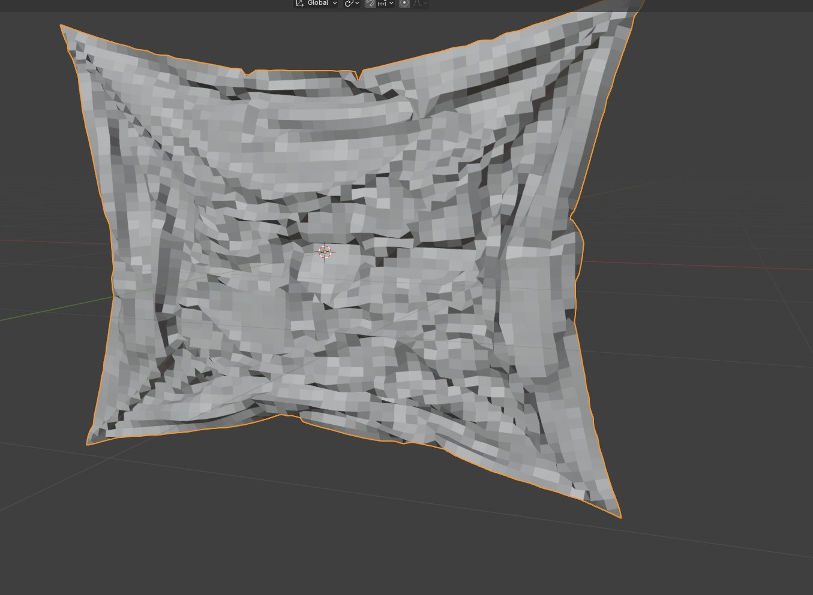

---

### 26. Shade Smooth и Subdivision Surface
Выделяем подушку -> ПКМ -> `Shade Smooth`.
В модификаторы добавляем `Subdivision Surface` (Levels = 2).

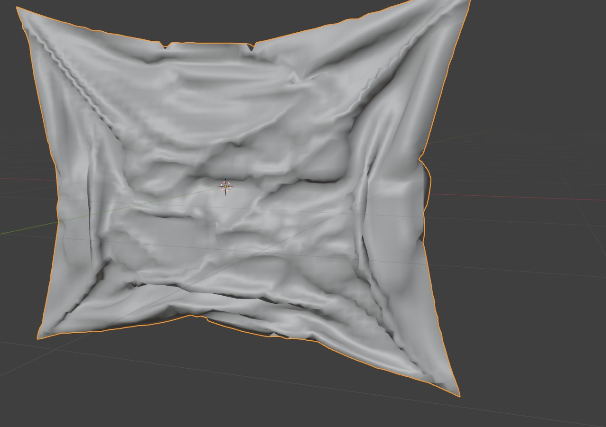

---

### 27. Настройка кэша
В модификаторе Cloth находим раздел **Cache**.
Ставим **End = 25** (симуляция на 25 кадров).
Нажимаем **Bake** (запекаем симуляцию).

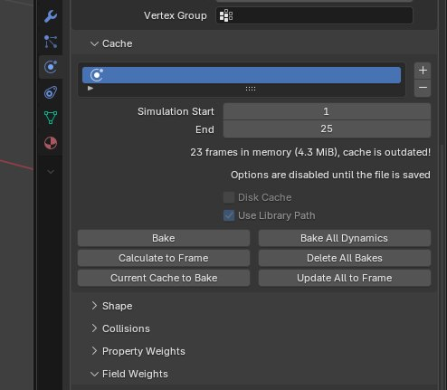

---

### 28. Применяем ткань
После того как симуляция готова — нажимаем **Apply** на модификаторе Cloth.

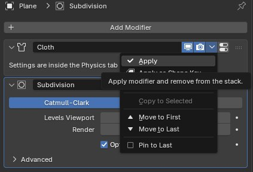

---

### 29. Создаём платформу для контраста тени
Выходим из Edit Mode.
Создаём большую платформу (`Shift + A` -> Mesh -> Plane) и располагаем под подушкой.
По бокам можно добавить ещё пару объектов для отражений.

> *(скриншот не требуется)*

---

### 30. Меняем рендер на Cycles и CPU
В правой панели идём во вкладку **Render Properties** (камера).
Меняем **Render Engine** с Eevee на **Cycles**.
Ниже в **Device** ставим **CPU** (для стабильности).

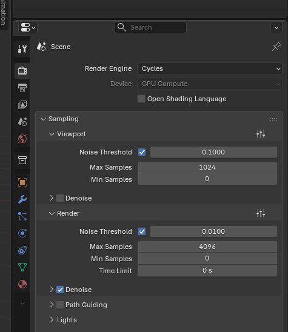

---

### 31. Максимальные сэмплы
В том же окне Render Properties опускаемся до раздела **Sampling**.
Ставим **Max Samples = 50** (для быстрого тестового рендера).

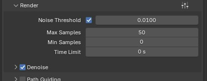

---

### 32. Создаём материал для подушки
Выделяем подушку. Идём во вкладку **Material Properties** (шарик).
Создаём новый материал.
Настраиваем Principled BSDF:
- **Transmission** → ставим `1` (полная прозрачность, как силикон)
- **Roughness** → ставим `0.1 - 0.15` (гладкая блестящая поверхность)

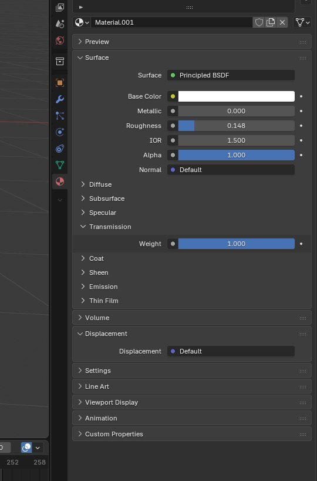

---

### 33. Скрываем подушку и работаем с текстом
В иерархии (Outliner) нажимаем на глазик рядом с подушкой, чтобы скрыть её на время.
Выделяем текст -> переходим в **Edit Mode**.
Нажимаем `A` -> `P` -> **By Loose Parts** (разделяем каждую букву в отдельный объект).

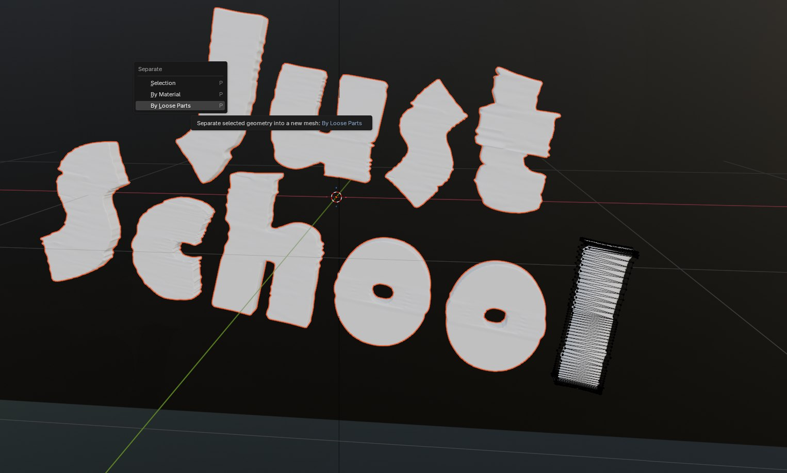

---

### 34. Центрируем все буквы
Выделяем все получившиеся объекты-буквы (можно нажать `A` дважды).
Нажимаем ПКМ -> **Set Origin** -> `Origin to Geometry` (центр масс каждой буквы).

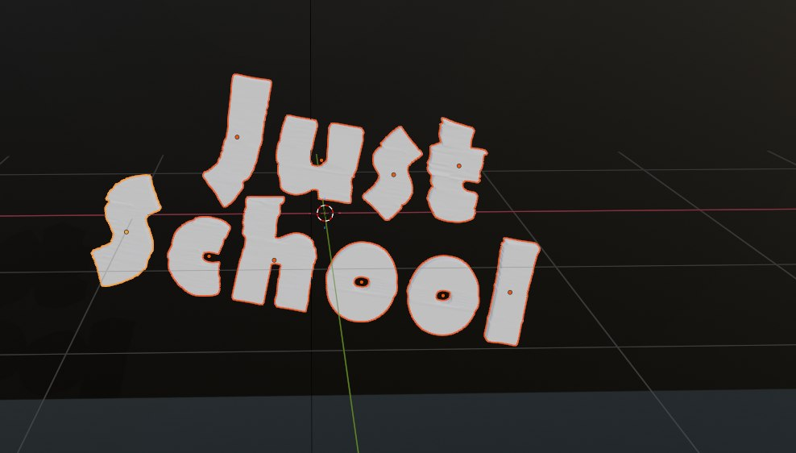

---

### 35. Объединяем материал
Выделяем **все** буквы (последняя, активная, должна быть обведена светлым).
В материалах создаём новый материал для активной буквы.
Нажимаем `Ctrl + L` -> **Link Materials** (копируем материал на все буквы).

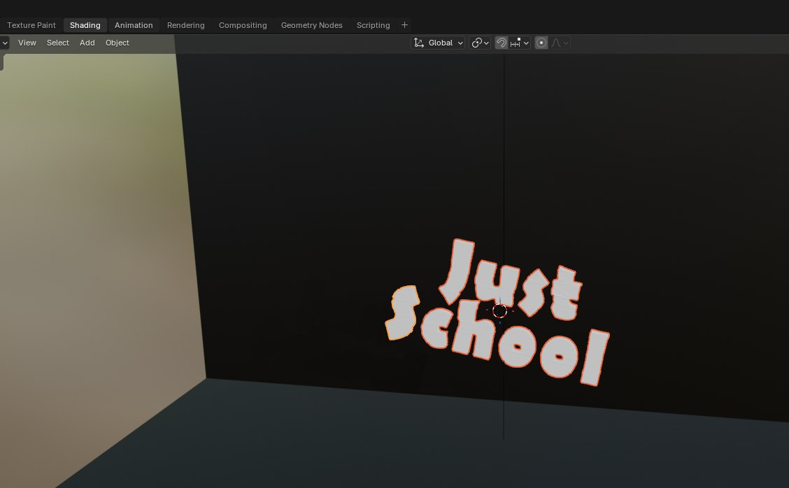

---

### 36. Переходим в Shading и делаем рандомный цвет
В верхнем меню меняем вкладку на **Shading**.
Создаём ноды:
- `Object Info` (Shift + A -> Input) — тянем **Random** в **Fac** колор рампа
- `Color Ramp` (Shift + A -> Converter) — настраиваем несколько ярких цветов
- Подключаем Color Ramp в **Base Color** материала

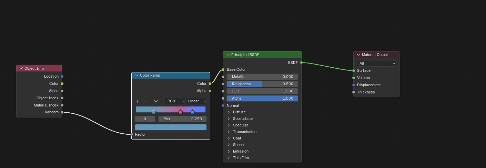

---

### 37. Финальный результат
Возвращаем подушку (включаем глазик).
Нажимаем `F12` для рендера.
Сохраняем изображение как `render.png`.

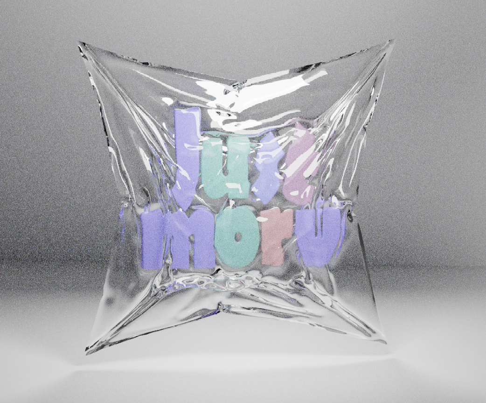