# Практическая работа в Blender: Симуляция ткани и анимация

**Класс:** 8-9
**Цель работы:** Создать 3D-сцену с двумя торами (колоннами), между которыми натянута ткань. Настроить симуляцию физики ткани и анимацию вращения одного из торов.

## Часть 1. Подготовка сцены и моделирование

### Шаг 1.1: Очистка сцены
При запуске Blender всегда появляется стартовый набор: куб, камера и источник света. Чтобы не запутаться, удалим их.
*   Нажмите клавишу **`A`** (латинская) один раз — это выделит все объекты в сцене.
*   Нажмите **`X`** и в появившемся меню выберите **«Удалить» (Delete)**.

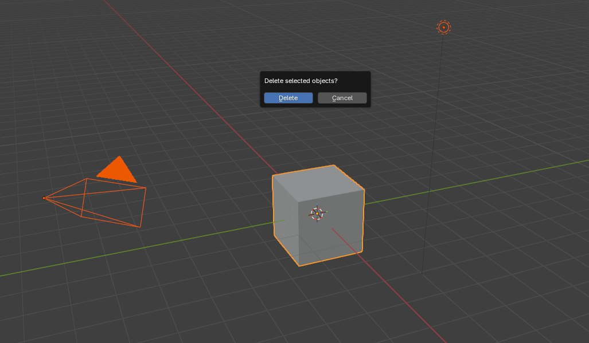
*Скриншот 1: Меню подтверждения удаления*

### Шаг 1.2: Настройка рабочего вида
Для удобства построения перейдём в проекцию «Спереди».
*   Нажмите **`1`** на цифровой клавиатуре (NumPad).
*   *Альтернатива:* Нажмите на зелёную точку с буквой **Y** на навигационном кубе в правом верхнем углу окна.

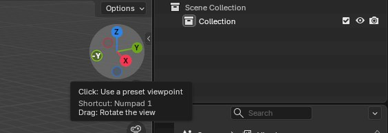
*Скриншот 2: Вид спереди (ось Y смотрит на нас)*

### Шаг 1.3: Создание первого тора
Тор — это объект в форме бублика или кольца.
*   Нажмите сочетание клавиш **`Shift + A`**.
*   В меню выберите **«Сетка» (Mesh)** -> **«Тор» (Torus)**.

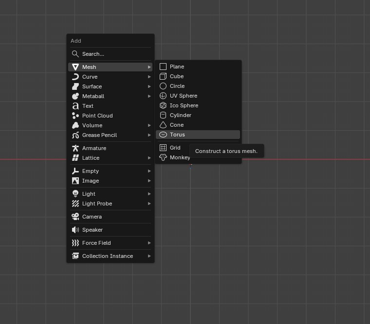
*Скриншот 3: Добавление тора*

### Шаг 1.4: Режим редактирования и поворот
Чтобы изменить форму объекта, нужно войти в режим редактирования его вершин, рёбер и граней.
*   Убедитесь, что тор выделен. Нажмите клавишу **`Tab`** для переключения в **«Режим редактирования» (Edit Mode)**. Также можно выбрать режим из выпадающего списка в левом верхнем углу 3D-вьюпорта.

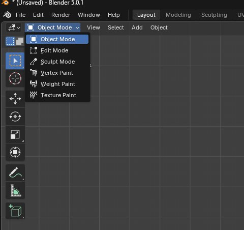
*Скриншот 4: Выбор режима редактирования*

Сейчас тор лежит горизонтально, а нам нужно поставить его вертикально, как колонну.
*   Нажмите последовательно клавиши (не зажимая, а по очереди):
    1.  **`R`** (активация инструмента поворота — Rotate).
    2.  **`X`** (привязка поворота к оси X).
    3.  **`90`** (введите число 90 с клавиатуры).
    4.  **`Enter`** (подтверждение действия).

Тор повернулся и стал похож на вертикальное кольцо.

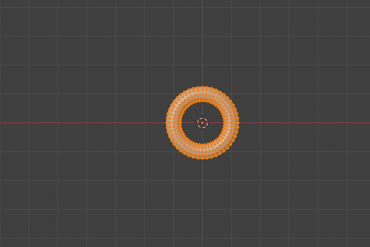
*Скриншот 5: Тор после поворота*

### Шаг 1.5: Перемещение тора
Переместим тор влево от центра сцены.
*   Нажмите последовательно:
    1.  **`G`** (активация инструмента перемещения — Grab).
    2.  **`-`** (клавиша «минус», чтобы задать отрицательное значение).
    3.  **`2`** (введите цифру 2, это будет расстояние в 2 единицы).
    4.  **`Enter`**.

Объект сместится по оси X влево.

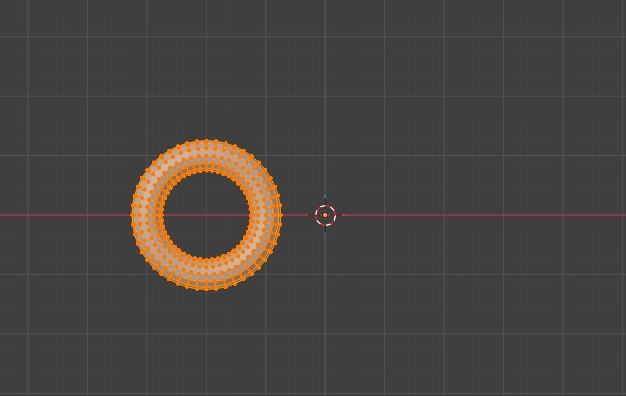
*Скриншот 6: Тор на позиции -2 по оси X*

### Шаг 1.6: Выход из режима и первое сглаживание
*   Выйдите из режима редактирования, снова нажав **`Tab`**.
*   Нажмите **правой кнопкой мыши** по тору и выберите пункт **«Сгладить затенение» (Shade Smooth)**. Это сделает отображение граней визуально гладкими, но геометрия останется угловатой, если присмотреться.

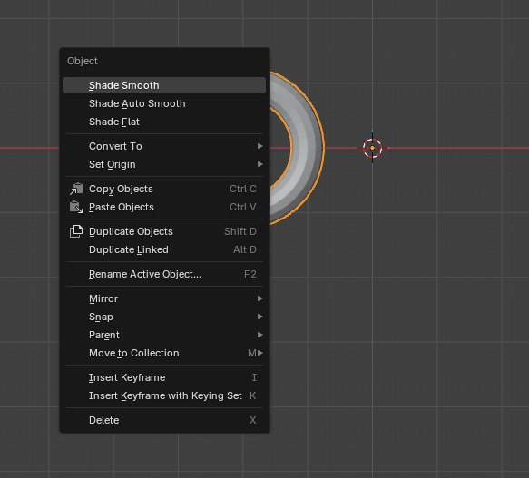
*Скриншот 7: Применение Shade Smooth*

### Шаг 1.7: Модификатор Subdivision Surface
Чтобы объект стал по-настоящему гладким, добавим специальный инструмент — модификатор.
*   В правой панели свойств найдите вкладку с **синим гаечным ключом** — это вкладка модификаторов.
*   Нажмите кнопку **«Добавить модификатор» (Add Modifier)**.

*Скриншот 8: Открытие вкладки модификаторов*

*   В открывшемся списке найдите и выберите **Subdivision Surface** (Поверхность подразделения). Можно начать вводить название в поиске.

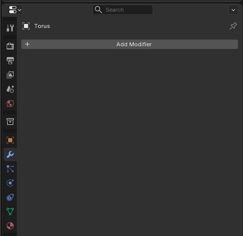
*Скриншот 9: Поиск модификатора*

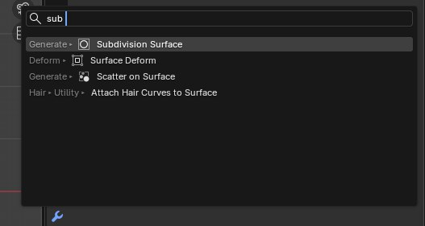
*Скриншот 10: Параметры модификатора*

Благодаря этому модификатору, геометрия объекта сглаживается, добавляя новые грани. Тор стал идеально круглым.

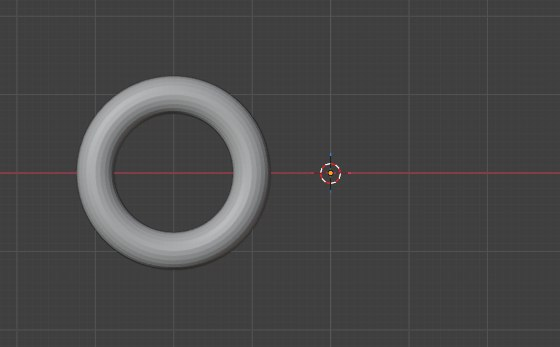
*Скриншот 11: Результат применения модификатора*

### Шаг 1.8: Дублирование тора
Нам нужна вторая такая же колонна справа.
*   Убедитесь, что тор выделен.
*   Нажмите **`Shift + D`** (копирование объекта). Сразу после этого, не нажимая ничего другого, введите с клавиатуры **`4`** и нажмите **`Enter`**. Копия переместится ровно на 4 единицы вправо.

Теперь у нас два тора на одинаковом расстоянии от центра.

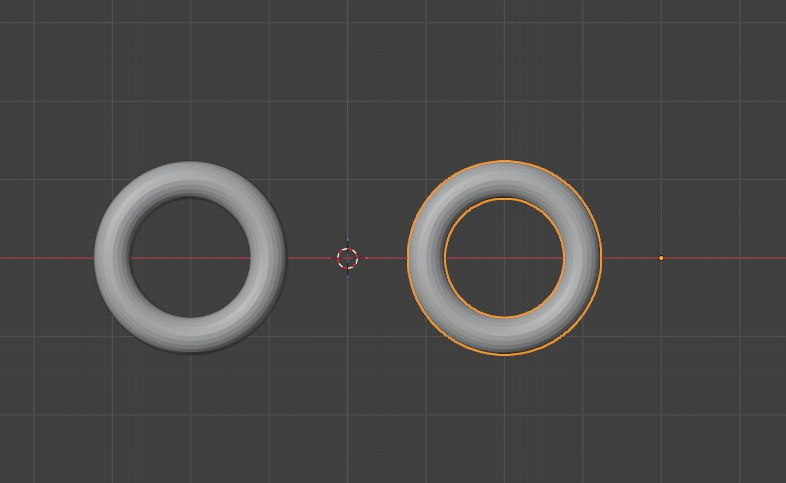
*Скриншот 12: Два вертикальных тора*

### Шаг 1.9: Создание заготовки для ткани
Ткань мы будем моделировать из окружности, которую затем превратим в сетку.
*   Нажмите **`Shift + A`** -> **Сетка (Mesh)** -> **Окружность (Circle)**.
*   Окружность появится в центре сцены, ровно между двумя торами.

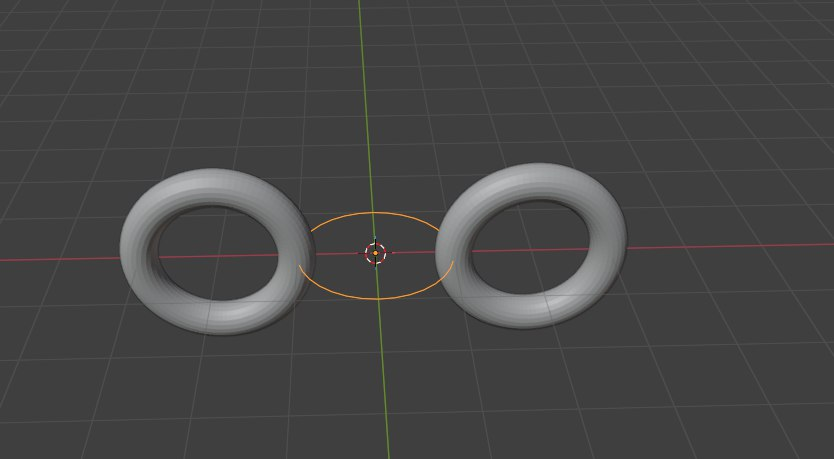
*Скриншот 13: Окружность (будущая ткань)*

### Шаг 1.10: Модификатор Mirror (Зеркало)
Чтобы сделать ткань симметричной, мы создадим только одну её половину, а вторую будет генерировать модификатор.
*   Перейдите в **режим редактирования (Edit Mode)** для окружности (**`Tab`**).
*   На вкладке модификаторов (синий ключ) добавьте модификатор **«Зеркало» (Mirror)**.

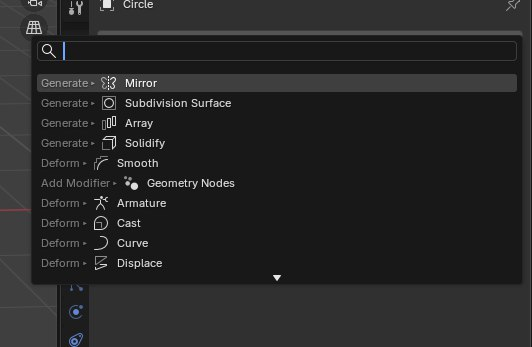
*Скриншот 14: Модификатор Mirror в списке*

*   По умолчанию зеркалирование работает по оси X. Вы должны увидеть вторую половинку круга справа. Если её нет, проверьте, стоит ли галочка напротив оси **X** в модификаторе.

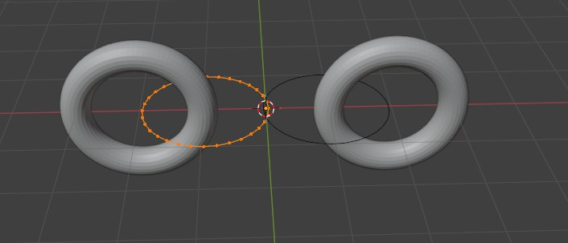
*Скриншот 15: Настройки модификатора Mirror*

### Шаг 1.11: Удаление лишнего
Нарисуем ткань в форме вытянутого прямоугольника.
*   Нажмите **`7`** на цифровой клавиатуре, чтобы перейти во **вид сверху**.
*   Выделите все вершины, которые находятся слева от центральной оси. Это половина нашего круга. Удобно выделять прямоугольным выделением (клавиша **`B`**).

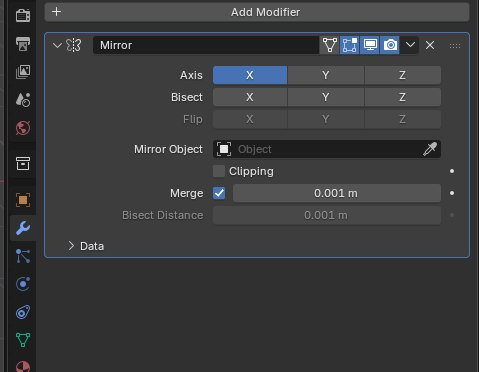
*Скриншот 16: Выделение левой половины вершин*

*   Нажмите **`X`** и выберите **«Удалить вершины» (Delete Vertices)**.

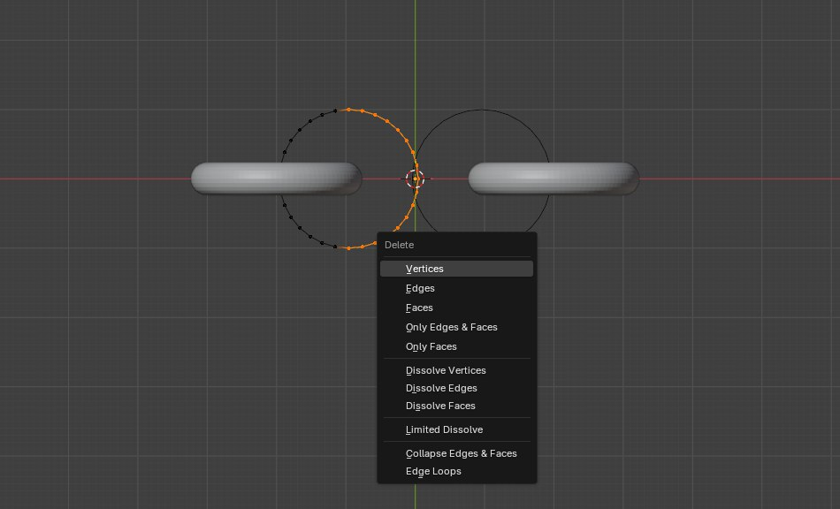
*Скриншот 17: Удаление вершин*

Теперь у нас осталась только правая половинка, а левая создается зеркально.

### Шаг 1.12: Соединение краев (Clipping)
Нам нужно замкнуть контур нашей будущей ткани.
*   Выделите **две крайние вершины** на одном из концов нашей дуги.

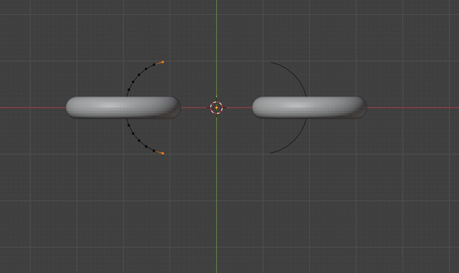
*Скриншот 18: Выделены вершины для соединения*

*   В модификаторе Mirror поставьте галочку **«Сшивка» (Clipping)**. Эта функция не даст вершинам «разъезжаться» при перемещении, удерживая их на оси симметрии.

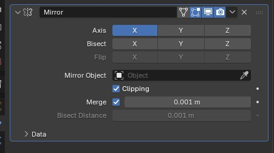
*Скриншот 19: Активация Clipping*

*   Теперь соединим вершины ребром. Нажмите **`E`** (выдавливание), затем **`X`** (чтобы двигаться строго по оси X) и немного подвиньте мышь, чтобы появилось ребро, соединяющее вершины. Зафиксируйте левой кнопкой мыши.

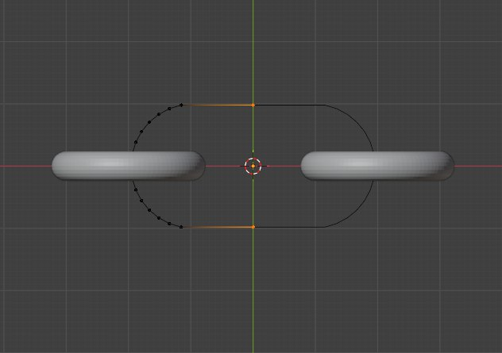
*Скриншот 20: Результат соединения вершин*

### Шаг 1.13: Добавление геометрии (Subdivide)
Наша ткань состоит из слишком крупных фрагментов. Чтобы она могла красиво изгибаться, нужно добавить ей больше вершин и рёбер.
*   Переключитесь в **режим выделения рёбер** (кнопка с тремя линиями на верхней панели).
*   Выделите **четыре длинных продольных ребра**, которые идут от центра к краям.

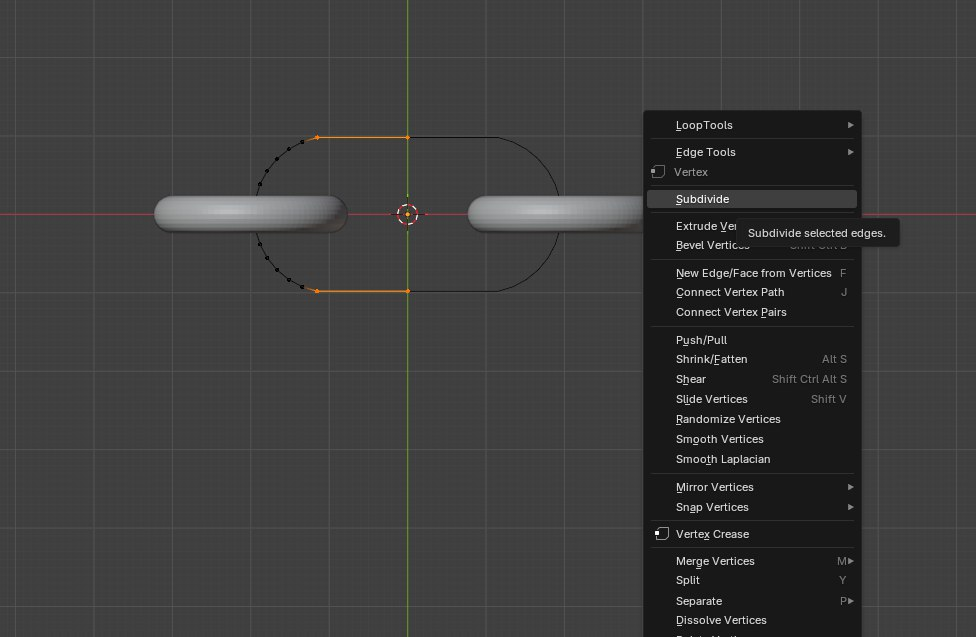
*Скриншот 21: Выделение рёбер для подразделения*

*   Нажмите **правую кнопку мыши** и выберите **«Подразделить» (Subdivide)**.
*   В левом нижнем углу появится меню последнего действия. Нажмите на него, чтобы раскрыть настройки.
*   В поле **«Количество разрезов» (Number of Cuts)** поставьте значение **3**.

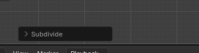
*Скриншот 22: Меню последнего действия*

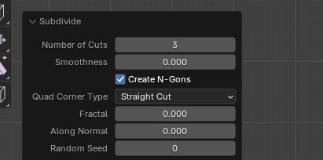
*Скриншот 23: Настройка количества разрезов*

Теперь наша ткань имеет достаточно плотную сетку для реалистичной симуляции.

### Шаг 1.14: Придаем объем ткани
*   Выделите **все** вершины сетки (нажмите **`A`**).
*   Нажмите **`E`** (выдавливание), затем **`Z`** (движение по вертикальной оси) и поднимите мышь вверх, чтобы создать высоту ткани. Зафиксируйте левой кнопкой мыши.

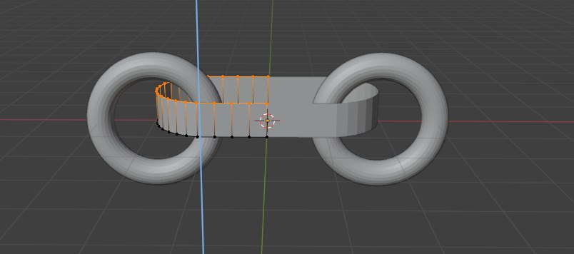
*Скриншот 24: Создание высоты ткани*

*   Добавим горизонтальные разрезы, чтобы ткань могла образовывать складки. Нажмите **`Ctrl + R`** (кольцевой разрез).
*   Наведите курсор на середину ткани. Появится желтая линия. Покрутите **колесико мыши**, чтобы увеличить количество разрезов до **2**.
*   Нажмите **Левую кнопку мыши** один раз, чтобы подтвердить положение линии, и второй раз, чтобы завершить операцию.

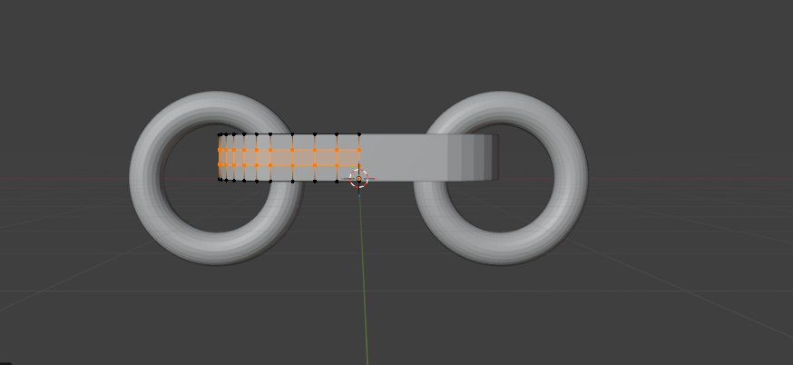
*Скриншот 25: Добавление горизонтальных разрезов*

### Шаг 1.15: Завершение моделирования ткани
*   Выйдите из режима редактирования (**`Tab`**).
*   Примените к ткани сглаживание: правая кнопка мыши -> **«Сгладить затенение» (Shade Smooth)**.
*   Если ткань получилась слишком высоко, опустите её немного по оси Z (клавиша **`G`** -> **`Z`**).

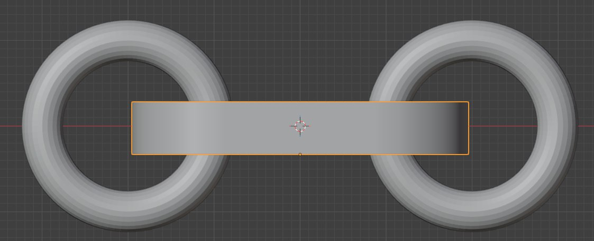
*Скриншот 26: Модель ткани готова к настройке физики*

## Часть 2. Физика и анимация

### Шаг 2.1: Настройка ткани (Cloth)
*   Выделите ткань.
*   Перейдите на вкладку с **зеленым шариком** (свойства физики).
*   Нажмите кнопку **«Сделать тканью» (Cloth)**. Объект получил физические свойства ткани.

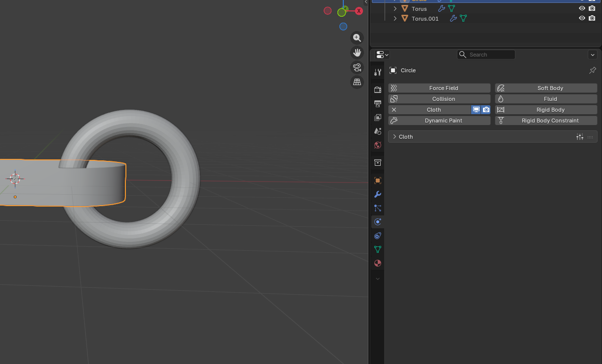
*Скриншот 27: Активация физики ткани*

### Шаг 2.2: Настройка столкновений (Collision)
Чтобы ткань взаимодействовала с торами и не проваливалась сквозь них:
*   Выделите **оба тора**. Для этого зажмите **`Shift`** и кликните по каждому из них. Активным (ярко-желтым) должен быть последний.
*   На той же вкладке физики (зеленый шарик) нажмите кнопку **«Физика» (Physics)** и выберите **«Столкновение» (Collision)**.

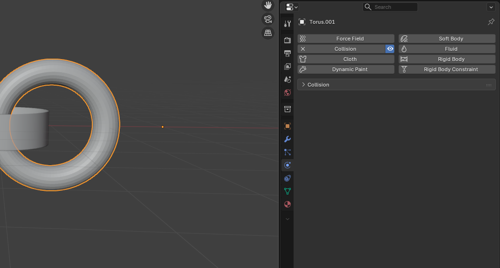
*Скриншот 28: Настройка торов как объектов столкновения*

### Шаг 2.3: Самопересечения ткани
Чтобы ткань при падении красиво ложилась складками и не проходила сама сквозь себя:
*   Снова выделите ткань.
*   В настройках модификатора Cloth (зеленый шарик) найдите раздел **«Столкновения» (Collisions)**.
*   Поставьте галочку **«Столкновения с собой» (Self Collisions)**.

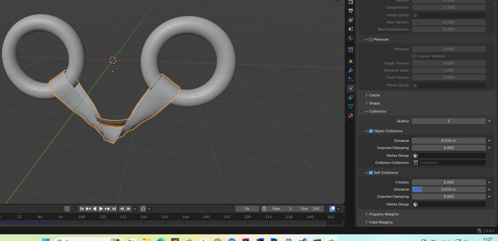
*Скриншот 29: Включение самопересечений*

### Шаг 2.4: Создание анимации вращения
Сделаем так, чтобы правый тор крутился и закручивал ткань.

1.  **Подготовка:**
    *   Разверните снизу панель анимации (Timeline), если её нет, потянув за границу окна.
    *   Установите ползунок на **1-й кадр**.
    *   Выделите **правый тор**.
    *   Нажмите клавишу **`N`**, чтобы открыть боковую панель, и перейдите на вкладку **«Преобразования» (Transform)**.

    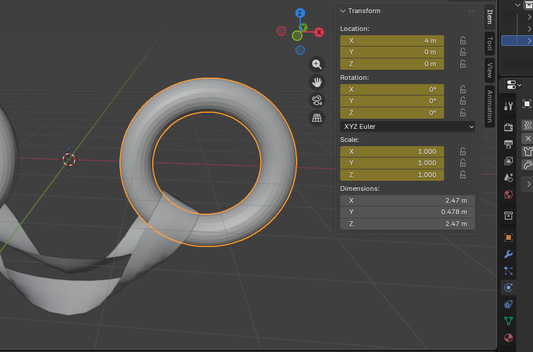
    *Скриншот 30: Окно Transform с параметрами объекта*

2.  **Ключевой кадр 1 (Старт):**
    *   В панели Transform в поле «Поворот X» должно быть **0°**.
    *   Нажмите клавишу **`I`** и выберите **«Поворот» (Rotation)**. Или нажмите правой кнопкой мыши по полю Rotation X и выберите «Вставить ключевой кадр». Появилась желтая метка на таймлайне.

3.  **Ключевой кадр 2 (Максимум вращения):**
    *   Переместите ползунок на кадр **48**.
    *   В поле «Поворот X» введите значение **`1200`**. (Это примерно 3.3 полных оборота).
    *   Снова нажмите **`I`** -> **«Поворот» (Rotation)**.

    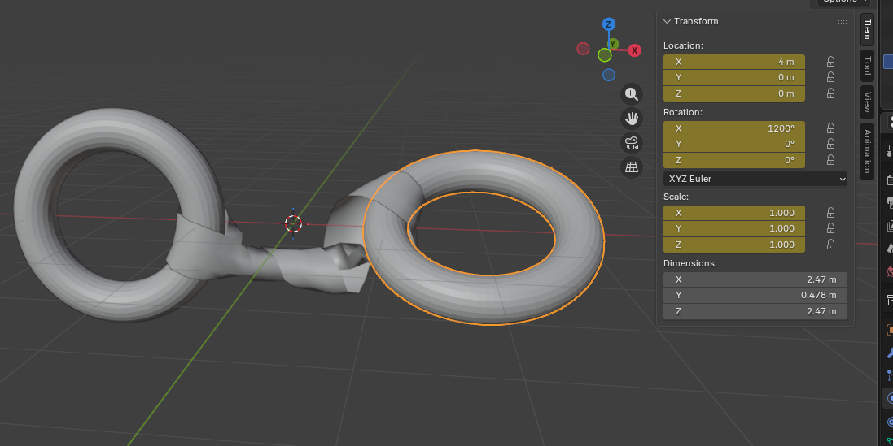
    *Скриншот 31: Установка поворота на 1200°*

4.  **Ключевой кадр 3 (Возврат):**
    *   Перейдите на кадр **180**.
    *   Нам нужно вернуть значение 0°. Проще всего скопировать его из первого кадра.
    *   Нажмите **`Shift + D`** прямо в поле Rotation X (или наведите мышь на него и нажмите), затем переместите ползунок на кадр 180. Значение скопируется.
    *   Нажмите **`I`** -> **«Поворот» (Rotation)**.

У вас получилось три ключевых кадра: 0° → 1200° → 0°. Теперь при запуске анимации тор будет делать полный оборот и возвращаться обратно.

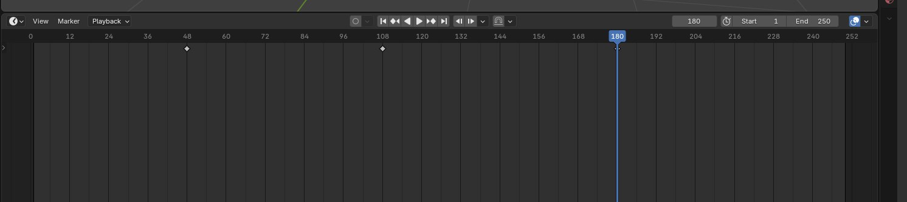
*Скриншот 32: Три ключевых кадра вращения*

### Шаг 2.5: Добавление толщины ткани (Solidify)
Тонкая пленка выглядит нереалистично. Сделаем ткань объемной с помощью модификатора.
*   Выделите ткань.
*   Перейдите на вкладку модификаторов (синий ключ) и добавьте модификатор **«Объём» (Solidify)**.
*   В параметре **«Толщина» (Thickness)** поставьте отрицательное значение, например **`-0.06`**. Отрицательное значение сделает толщину внутрь, что для ткани смотрится лучше. Поэкспериментируйте.

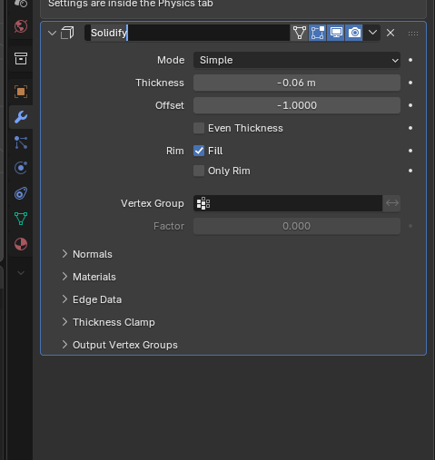
*Скриншот 33: Модификатор Solidify с отрицательной толщиной*

Ткань приобрела объем и стала похожа на настоящее полотно.

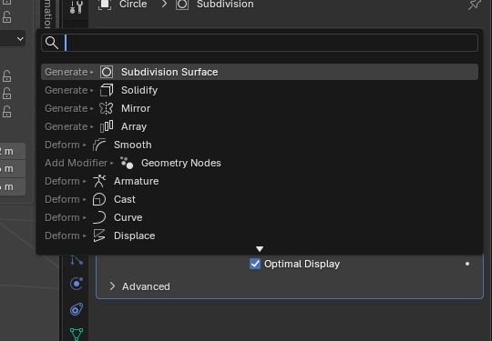
*Скриншот 34: Результат — объемная ткань*

## Часть 3. Финальный этап и самостоятельная работа

### Шаг 3.1: Финальное сглаживание
Чтобы наша сцена выглядела еще лучше, добавим модификаторы сглаживания всем объектам:
*   Выделите ткань, добавьте модификатор **Subdivision Surface**.
*   Выделите оба тора, добавьте им модификатор **Subdivision Surface**.

### Шаг 3.2: Задание для самостоятельной работы
Теперь вы можете сделать сцену законченной и красивой самостоятельно. Попробуйте:
1.  **Создать фон:** Добавьте большую плоскость (**Shift + A -> Сетка -> Плоскость**) под сценой и, возможно, сзади неё.
2.  **Настроить свет:** Добавьте источники света (**Shift + A -> Свет**). Поэкспериментируйте с типами света (Точечный, Солнце, Пятно), их положением и яркостью.
3.  **Запустить анимацию:** Нажмите **Пробел** и посмотрите, как красиво ткань закручивается вращающимся тором.
4.  **(Опционально) Настроить материалы:** Попробуйте изменить цвет ткани и торов на вкладке с красным шариком (материалы).

Готовая сцена может стать отличным стартом для изучения более сложных симуляций в Blender!