# Создаем анимированного ежика в Blender 

Сегодня мы не просто будем тыкать кнопки, мы создадим настоящего персонажа с волосами, которые двигаются как настоящие, и заставим его взаимодействовать с предметами.

**Что мы сделаем:**  
Мы возьмем обычную сферу, превратим ее в тело ежика, добавим ей иголок (волос), а затем научим их падать под тяжестью бублика и снова подниматься. Звучит круто? Поехали!

---

## Этап 1: Подготовка сцены (Наводим порядок) 

Когда ты открываешь Blender, там всегда есть куб, лампа (свет) и камера. Нам многое лишнее не нужно.

1. **Удаляем лишнее:** Наведи мышку на **лампу** (источник света), нажми `Delete`. Потом наведи на **камеру** и тоже нажми `Delete`.
   - **Зачем?** Свет мы потом добавим другой, а камера нам пока мешает смотреть на сцену со всех сторон.
   - Куб трогать не надо, мы будем работать с ним.
2. 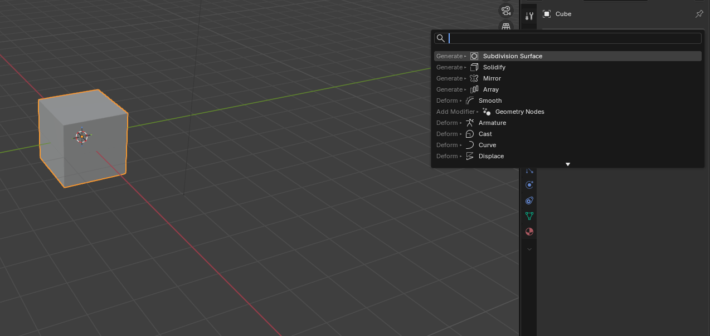 - *На сцене должен остаться только куб.*

---

## Этап 2: Делаем из куба мягкую заготовку 

Квадратный ежик — это некрасиво. Нужно сгладить углы.

3. **Выдели куб** (нажми на него левой кнопкой мыши).
4. **Добавляем магию сглаживания:** Справа, в колонке с иконками, найди **гаечный ключ** (это модификаторы). Нажми «Добавить модификатор» и выбери **Subdivision Surface**.
   - **Что это?** Этот модификатор делает твою модель более гладкой, как будто ее слепили из пластилина. Он делит грани на более мелкие.
5. **Настраиваем:** В появившемся меню найди `Levels Viewport` (Уровни в окне просмотра) и поставь цифру **4**.
   - Чем больше цифра, тем глаже фигура. 4 — самое то для нашего ежика.
6. 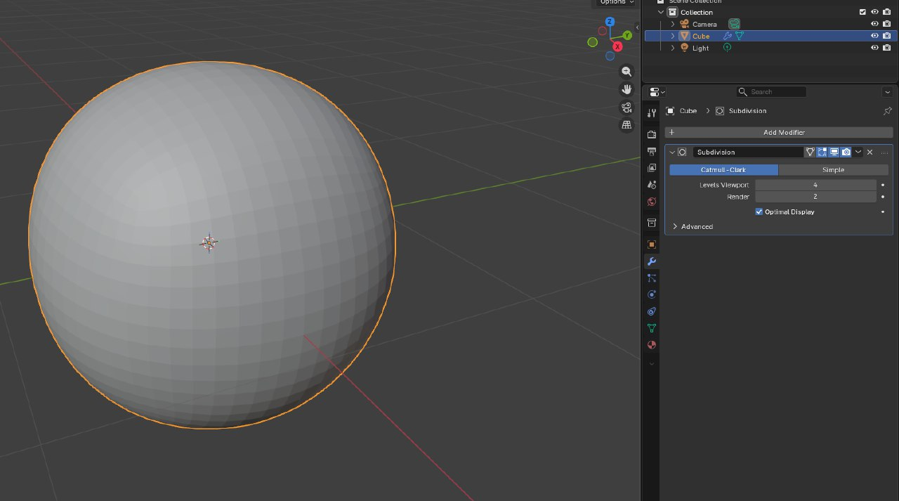 - *Показываем, где стоит цифра 4 в модификаторе.*

---

## Этап 3: Фиксируем результат (Apply) 

Модификатор — это как временный эффект. Чтобы он навсегда «приклеился» к кубу, нужно его применить.

7. Рядом с названием модификатора `Subdivision Surface` есть стрелочка вниз. Нажми её и выбери **Apply** (Применить).
8. 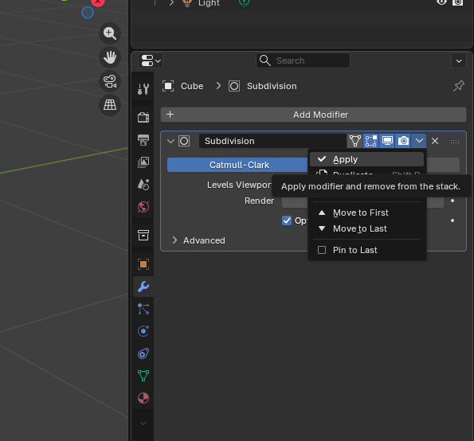 - *Стрелка и кнопка Apply.*

---

## Этап 4: Делаем поверхность визуально гладкой

Теперь куб стал круглым, но выглядит немного зернистым, если присмотреться.

9. Нажми **Правой кнопкой мыши** по сфере (бывшему кубу) и выбери **Shade Smooth** (Гладкое затенение).
   - Теперь он выглядит как настоящий гладкий шарик!

---

## Этап 5: Включаем рентген-вид 

Чтобы было удобнее работать с частицами внутри сферы, включим каркасный режим.

10. Нажми клавишу **Z** и выбери **Wireframe** (Проволочный каркас) или нажми кнопку с шариками в правом верхнем углу 3D-вьюпорта.
    - Теперь ты видишь сферу прозрачной, как рентгеновский снимок.

---

## Этап 6: Начинаем растить иголки! 

Переходим к самому интересному — делаем из шара ежика.

11. Слева, в панели инструментов (там, где иконки), найди **Particles** (это вкладка Particles — Частицы).
12. Нажми на **плюсик** (+), чтобы добавить новую систему частиц.
13. 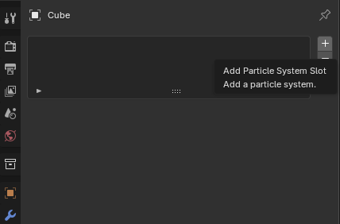 - *Кнопка «+» в разделе Particles.*
14. Сразу же в настройках поменяй тип с **Emitter** (Излучатель) на **Hair** (Волосы).
    - **Зачем?** Emitter делает частицы, которые исчезают. А Hair делает длинные волоски, которые остаются на поверхности. Именно это нам и нужно для иголок.
15. 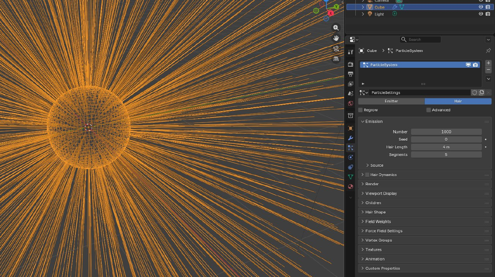 - *Выбираем Hair в выпадающем списке.*

---

## Этап 7: Делаем иголки подлиннее и покрасивее 

16. В настройках частиц (все там же, под Particles) найди параметр **Hair Length** (Длина волос) и поставь **0.52**.
    - Иголки будут такой длины.
17. 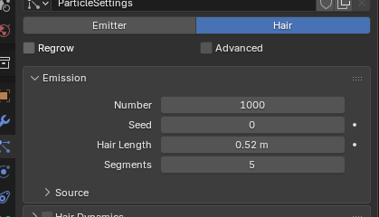 - *Поле Hair Length.*

---

## Этап 8: Добавляем «пушистости» (Дочерние пряди) 

Сейчас волос мало. Чтобы их стало густо, как у ежика, нужно включить «детей».

18. Раскрой вкладку **Children** (Дети).
19. Вместо `None` выбери **Interpolated** (Интерполированные).
    - Программа сама добавит много волосков между теми, которые у нас уже есть.
20. 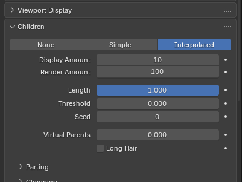 - *Выбор Interpolated.*

---

## Этап 9: Упрощаем картинку, чтобы не тормозил компьютер 

Чем больше волос, тем сложнее компьютеру их рисовать. Мы покажем программе, как рисовать их попроще во время настройки.

21. Найди вкладку **Viewport Display** (Отображение в окне просмотра).
22. Поставь  **Strands Steps** (Шаги прядей) и введи значение **4**.
    - Это значит, что каждый волосок будет рисоваться из 4 кусочков. Для нас это все еще похоже на волосы, а компьютер радуется, что ему легче работать.
23. 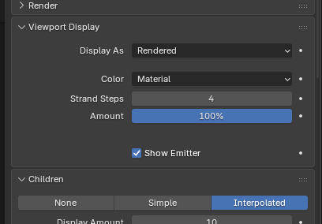 - *Поле Strands Steps = 4.*

---

## Этап 10: Делаем иголки гладкими и красивыми 

В реальности волосы и иголки плавно изгибаются, а не ломаются под углом.

24. Перейди во вкладку **Render** (Визуализация). Она отвечает за то, как волосы будут выглядеть в итоговом видео или картинке.
25. В разделе **Path** (Путь) поставь галочку **B-Spline**.
    - **B-Spline** — это способ сделать линию плавной. Теперь наши иголки не будут угловатыми.
26. 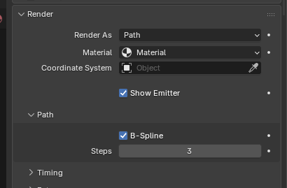 - *Галочка B-Spline.*

---

## Этап 11: Регулируем густоту иголок 

Иголок у ежика должно быть много, но не слишком.

27. Зайди во вкладку **Emission** (Эмиссия / Излучение).
28. В поле **Number** (Количество) поставь **250**.
    - Это количество волос на поверхности. Поиграй с этим числом позже, чтобы понять, как оно влияет.
29. 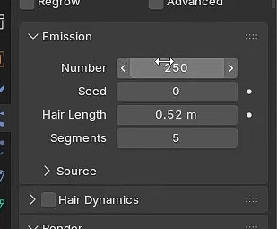 - *Поле Number = 250.*

---

## Этап 12: Оживляем иголки! Включаем физику 

Самое крутое: сделаем так, чтобы иголки двигались, как настоящие волосы.

30. Сразу под настройкой `Emission` поставь галочку **Hair Dynamics** (Динамика волос).
31. Теперь нажми на клавиатуре **пробел**, чтобы запустить анимацию.
    - **Смотри!** Наши волосы/иголки стали мягкими и покачиваются, как будто на них дует ветер! Они реагируют на гравитацию.
32. 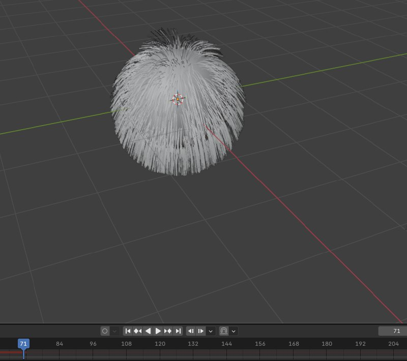 - *Галочка Hair Dynamics.*

---

## Этап 13: Учим сферу чувствовать прикосновения 

Чтобы иголки понимали, что к ним прикоснулись (например, бубликом), сфера должна уметь реагировать на столкновения.

33. Убедись, что сфера выделена. В правой панели свойств найди вкладку с **синим мячиком** (это Physics — Физика).
34. Нажми **Collision** (Столкновение).
    - Теперь наша сфера — это твердая поверхность для других объектов.
35. 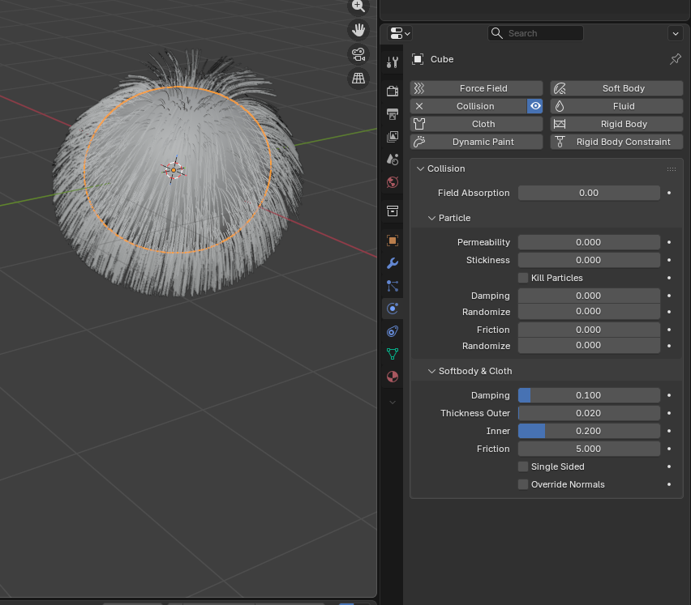 - *Кнопка Collision.*

---

## Этап 14: Создаем расческу для ежика — Бублик 

Теперь создадим объект, который будет приминать наши иголки.

36. Нажми сочетание клавиш **Shift + A** (или нажми «Добавить» в верхнем меню).
37. Выбери **Mesh** (Сетка) -> **Torus** (Тор).
38. Перемести бублик (нажми `G` и двигай мышкой) так, чтобы он висел в сферу, **не касаясь ее**.
39. 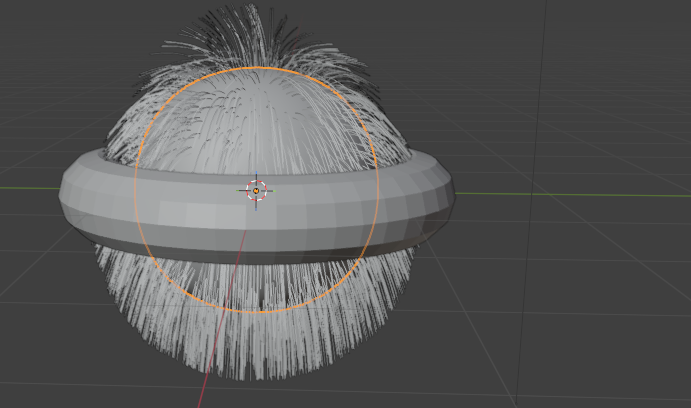 - *Torus висит в середине.*

---

## Этап 15: Прихорашиваем бублик

40. Нажми **ПКМ** по тору -> **Shade Smooth**, чтобы он стал гладким.
41. Сделай его таким же сглаженным, как и сферу: иди в **гаечный ключ** (модификаторы) и добавь ему модификатор **Subdivision Surface**.
42. Подними бублик наверх, над сферой.
43. 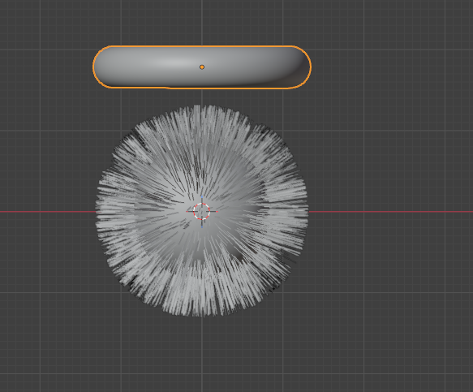 - *Тор (гладкий) висит над сферой.*

---

## Этап 16: Оживляем бублик (Базовая анимация) 

Сейчас мы заставим бублик двигаться.

44. **Важно!** Убедись, что таймлайн (полоска с цифрами внизу экрана) стоит на кадре **1**.
45. Нажми клавишу **I**, Появится желтый ромбик — это ключ анимации. Мы запомнили положение бублика в 1-м кадре.
46. 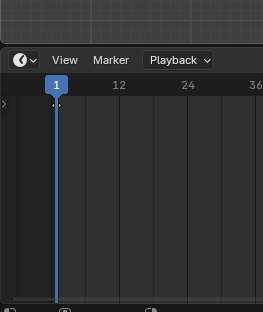 - *Таймлайн на кадре 1, нажат I.*

47. Передвинь ползунок на таймлайне на кадр **70**.
48. Опусти бублик вниз, так чтобы он **коснулся верхушки сферы** и немного примял ее. Снова нажми `I` -> `Location`.
49. Перейди на кадр **90**. Не двигай бублик! Просто нажми `I` -> `Location`.
    - **Зачем?** Мы говорим программе: «В кадре 90 бублик все еще должен быть внизу, не улетай обратно».
50. 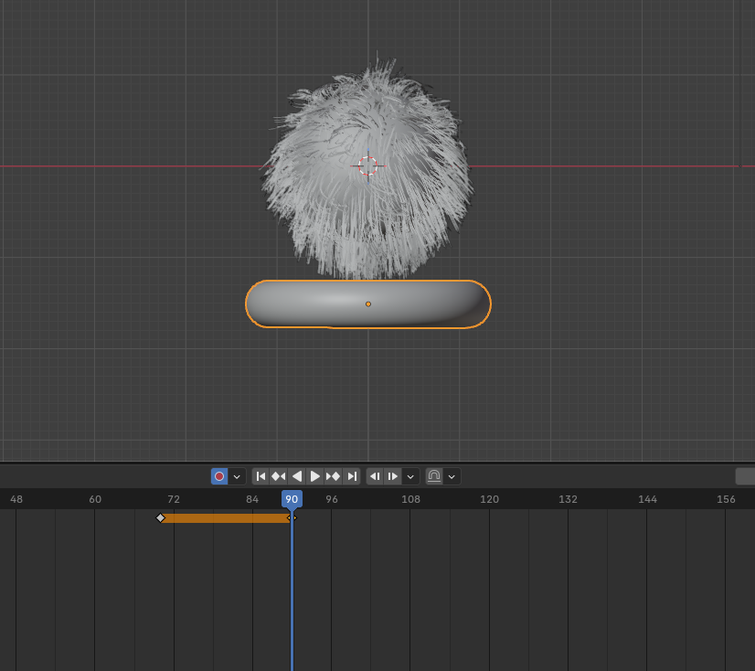 - *Тор на кадре 70 внизу, на кадре 90 тоже внизу.*

51. Выдели желтый ромбик на кадре 1, нажми **Shift + D** (дублировать) и перетащи получившийся ромбик мышкой на кадр **130**.
    - Этим мы говорим бублику вернуться наверх к 130-му кадру.
52. Растяни анимацию подлиннее. В поле `End` на таймлайне (конец анимации) поставь **150**.

---

## Этап 17: Бублик тоже должен давить на иголки!

53. Выдели бублик (Тор). Перейди на вкладку с **синим мячиком** (Physics) и тоже нажми **Collision**.
    - Теперь, когда бублик касается сферы, иголки будут понимать, что это твердый объект.

---

## Этап 18: Делаем иголки жесткими, как у настоящего ежа! 

Сейчас иголки слишком мягкие и вялые. У ежа они должны быть упругими.

54. Выдели **сферу**.
55. В свойствах частиц Particles найди раздел **Hair Dynamics**.
56. Раскрой в нем вкладку **Structure** (Структура).
57. Найди параметр **Stiffness** (Жесткость) и измени его с **0.5** на **2.0**.
    - Запусти анимацию снова. Видишь? Иголки стали упругими и не так сильно болтаются, а пытаются вернуться в исходное положение.

---

## Этап 19: Крутим бублик! (Добавляем вращение) 

Сделаем так, чтобы бублик не просто опускался, но и крутился вокруг сферы, приминая иголки по спирали. Это сложно, но мы справимся!

58. Выдели бублик.
59. Перейди на кадр **50** на таймлайне.
60. Нажми на кружок рядом с полем `Location` 
61. 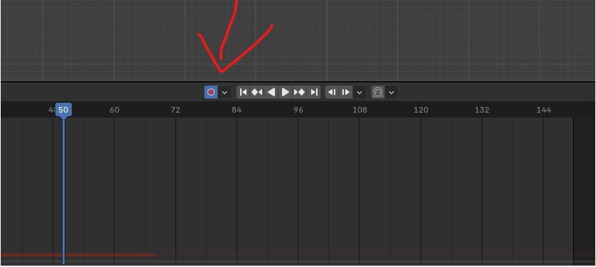 - *Кнопка-кружок для ключа анимации.*

62. Перемести бублик (`G`) так, чтобы он оказался на уровне **середины сферы сбоку**.
63. 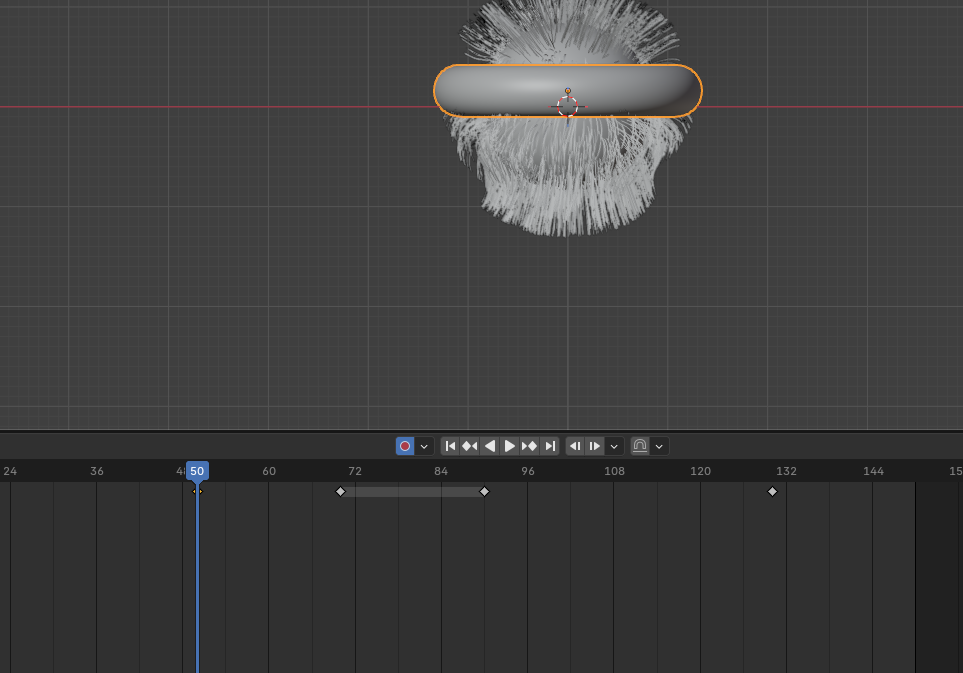 - *Тор сбоку от сферы, на середине высоты.*

64. Перейди на кадр **60**. Выдели ключ на кадре 50 (желтый кружок) и продублируй его на кадр 60 (`Shift + D`).
65. Теперь, находясь на кадре 60, нажми **R** (поворот), потом **X** (чтобы крутить вокруг оси X) и, двигая мышкой, сделай **один полный оборот** бублика вокруг своей оси. Нажми `Enter`.
66. Перемести получившиеся ключи на кадрах 70 и 90 (которые были внизу) на новые места: **90** и **110**. Для этого выдели их (зажав Shift), нажми `G` и сдвинь на таймлайне.
67. 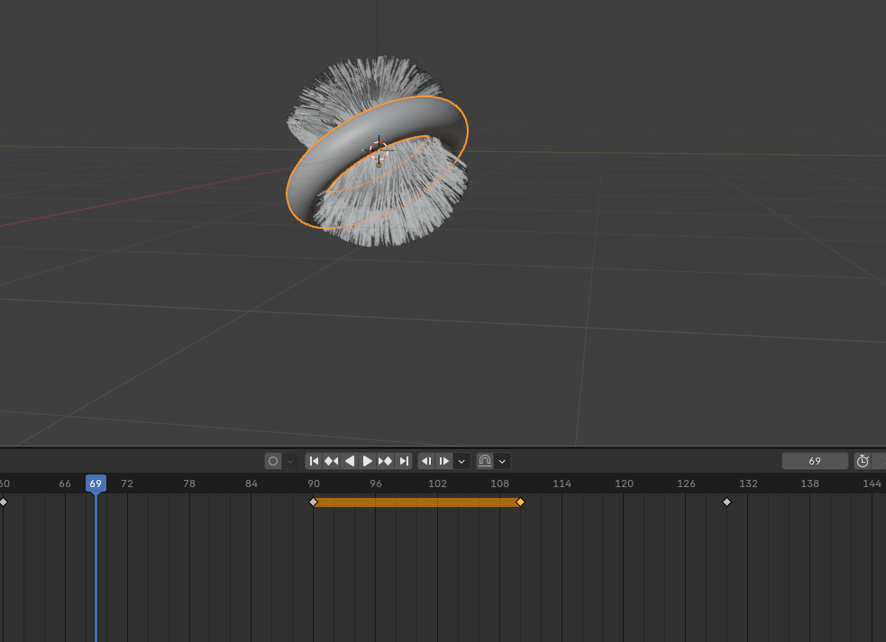 - *Ключи сдвинуты на 90 и 110.*

68. Теперь сделаем так, чтобы бублик крутился дольше:
    - Выдели ключ на кадре **50**, нажми `Shift + D` и поставь копию на кадр **70**.
    - Выдели ключ на кадре **70** (новый), `Shift + D` -> поставь на кадр **80**.
69. 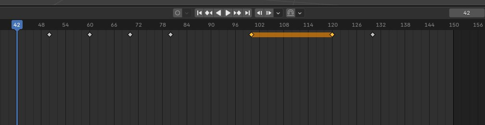 - *Новые ключи на 70 и 80.*

70. Сдвинь последние ключи (где бублик наверху) с кадров 110 и 130 на кадры **110** и **120**.
71. Скопируй самый первый ключ (кадр 1) на кадр **40**. Для этого выдели ключ на 1, `Shift + D` -> перетащи на 40.
72. На кадре 40 поставь бублик обратно наверх сбоку (как на скриншоте 18).
73. 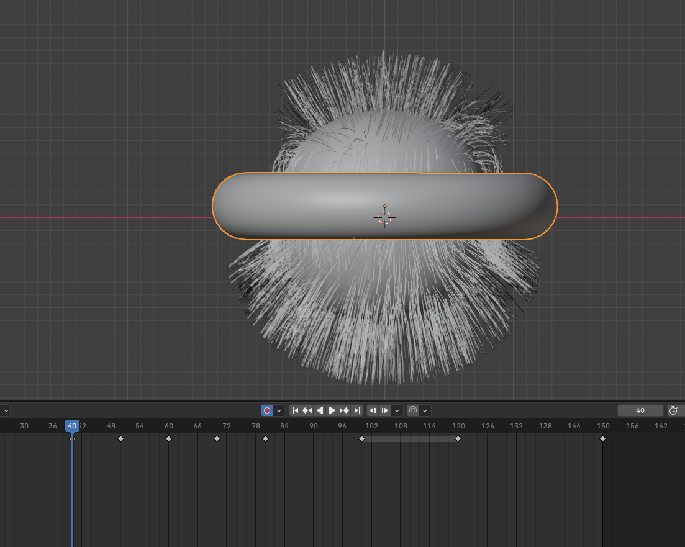 - *Тор наверху сбоку в кадре 40.*

**Поздравляю!** Мы создали сложную анимацию, где бублик опускается, давит на иголки, крутится и поднимается.

---

## Этап 20: Финальный штрих — «Ежизация» иголок 

Наши волосы все еще похожи на волосы, а не на иголки. Сделаем их острыми и торчащими в стороны.

74. Выдели **сферу**.
75. В свойствах частиц Particles зайди во вкладку **Children**.
76. Найди настройки **Clumping** (Слипание). Поставь ползунок **Clump** на максимум (**1.000**). Это заставит иголки собираться в пучки на концах.
77. 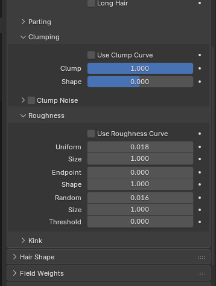 - *Clump = 1.*

78. Ниже найди настройки **Uniformity** (Однородность) и **Random** (Случайность).
    - **Uniformity** поставь **0.18**.
    - **Random** поставь **16**.
    - Эти параметры сделают так, что иголки будут торчать в разные стороны, а не только по линиям, и будут выглядеть более естественно и колюче.

---

## ГОТОВО! СМОТРИМ РЕЗУЛЬТАТ! 

Запусти анимацию (пробел) и посмотри на своего ежика! У него есть упругие колючки, на которые опускается крутящийся бублик, приминает их, а когда поднимается — иголки снова встают на место.

79. 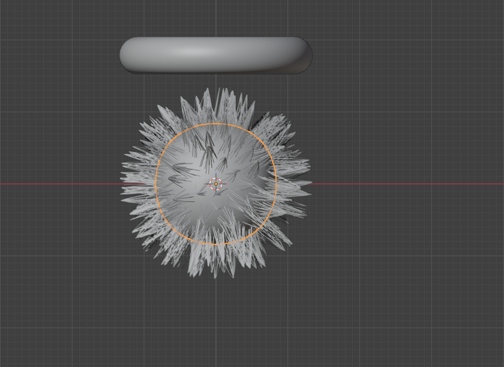 - *Финальный кадр с красивым ежиком.*

# Самостоятельная работа 
Попробуй улучшить свою сцену самостоятельно.

---

## 1. Сделай фон

Добавь:
- **пол** (плоскость)
- **стену** позади объекта

Размести их так, чтобы объект стоял на полу, а сзади была стенка.

---

## 2. Добавь свет 

Добавь один или несколько источников света.  
Попробуй разные типы света и посмотри, как меняется сцена.

---

## 3. Добавь цвет 

Создай материалы для объектов:

- **Сфера** — выбери любой цвет  
- **Бублик** — выбери цвет и попробуй сделать его **металлическим**

Поэкспериментируй с параметрами **Metallic** и **Roughness**.

---

## Супер-задание  
### Второй бублик

Добавь **второй бублик**.

Расположи два бублика так, чтобы они выглядели **как орбита с двумя кольцами вокруг сферы**.

Можно сделать:
- разные размеры колец
- разные углы наклона
- разное вращение

---

